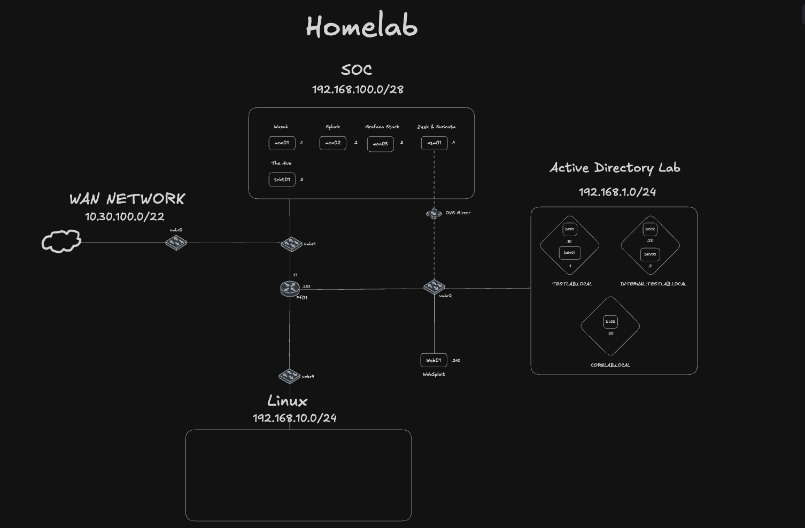

# Universe Homelab

A segmented, multi-forest Active Directory homelab built for blue team operations, SOC workflow development, and infrastructure monitoring. The environment simulates a realistic enterprise network across isolated VLANs — complete with endpoint telemetry, SIEM ingestion, network security monitoring, and container-based tooling.



---

## Network Segments

| Segment | Purpose | Key Hosts |
|---|---|---|
| **All** | Perimeter routing & firewall | `pf01` |
| **LAB-LAN** | Active Directory forests + endpoints | `DC01` · `DC02` · `DC03` · `dev01` · `dev02` |
| **MGMT-LAN** | SIEM, SOC, and observability stack | `mon01` · `so01` · `mon02` |
| **LINUX-LAN** | Containers, CI/CD, and automation | `linux01` |

---

## Infrastructure at a Glance

### Edge — `pf01`

pfSense appliance handling stateful inspection, NAT, routing. Single point of ingress/egress for the entire lab.

### Active Directory — LAB-LAN

Three domain controllers span two forests with a parent/child trust:

- **`testlab.local`** — primary forest (`DC01`)
  - `internal.testlab.local` — child domain (`DC02`)
- **`corelab.local`** — separate forest for core services (`DC03`)

Two Windows workstations (`dev01`, `dev02`) generate endpoint telemetry via **Sysmon** and ship logs through the **Splunk Universal Forwarder**.

### SOC & SIEM — MGMT-LAN

| Host | Stack | Role |
|---|---|---|
| `mon01` | Splunk Enterprise · Wazuh | Central log aggregation, alerting, and case management |
| `so01` | Security Onion · Zeek · Suricata | Full-packet capture, IDS/IPS alerts, and network visibility |

### Monitoring — MGMT-LAN

| Host | Stack | Role |
|---|---|---|
| `mon02` | Prometheus · Grafana · Netdata · | Infrastructure health metrics and dashboarding |

### Linux Infra — LINUX-LAN

| Host | Stack | Role |
|---|---|---|
| `ci-cd01` | · K3-master node · GitLab · Jenkins | Container orchestration, CI/CD pipelines |

---


## Roadmap

- [ ] **LimaCharlie EDR** — cloud-native endpoint detection and response
- [ ] **Velociraptor** — forensic triage and live response (server + Windows/Linux agents)
- [ ] **SCCM** — integrated with the Active Directory environment for endpoint management
---

## Repo Structure

```
.
├── Configs/       # Configuration files for lab services
├── Ideas/         # Design notes and future plans
├── Services/      # Service-specific documentation
└── README.md
```

---

## License

This project is shared for educational purposes. Use at your own risk.
